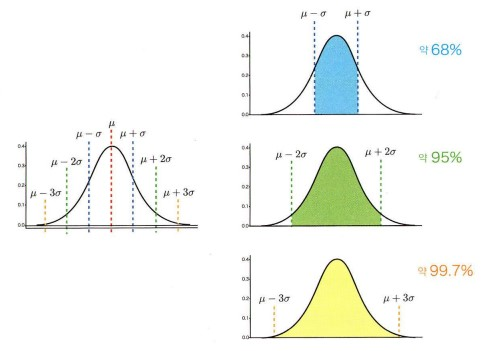

# 1주차 : 이론적인 확률분포 내용 정리

### 1. 확률분포와 파라티머
1. 수식으로 표현
2. 분포의 형태를 정하는 숫자이 **파라미터(parameter)** 를 가짐.
4. 파라미터를 알면 **확률분포의 형태** 를 알 수 있음.
 

### 2. 정규분포 (가우스 분포)

**1) 확률밀도 함수 식**  
$f(x)=
\frac{1}{\sqrt {2πσ^2}} exp[-\frac{(x-μ)^2}{2σ^2}]
$ 

- 확률분포가 평균μ와 표준편차σ 라는 2가지 파라미터가 정해짐.
- 정규분포는 $N(μ, σ^2)$으로 표기.
- 이때 평균 μ=0, 표준편차 σ=1인 정규분포 N(0, 1)을 *표준정규분포* 라고 함.
- μ는 분포의 위치, σ는 분포의 넓이를 결정
 
 
**2) 정규분포 특징**
- 평균 μ 중심으로 한 종형, 좌우 대칭 분포임.
- 평균 μ 근처에 값이 가장 많고,  평균 μ에서 멀어질수록 적어짐.  
 

**3) 정규분포 성질**  
  
(색으로 칠한 넓이가 그 범위에 값이 속할 확률에 대응함.)
- μ-σ부터 μ+σ까지의 범위 값이 있을 확률 -> 약 68% 
- μ-2σ부터 μ+2σ까지의 범위 값이 있을 확률 -> 약 95% 
- μ-3σ부터 μ+3σ까지의 범위 값이 있을 확률 -> 약 99.7%   
 

 **알 수 있는 점 : 이러한 특징과 성질은 μ나 σ의 값이 달라져도 변하지 않습니다.**

 

### 3. 표준화
**정의** :  확률변수 x 또는 데이터의 μ평균 $\bar{x}$와 표준편차 σ(s)를 이용하여 

$z=
\frac{x-μ}{σ} $  
  
*평균 0, 표준편차 1*로 변환할 수 있음.
 

- 변환된 새로운 값을 *z값*이라고 부르기도 함. 
- 평균과의 거리가 표준편차의 몇 배인가를 나타냄.  
- 본래의 μ나 σ와 상관없이 분포 안에서 어디에 위치하는가를 알 수 있음. 

 

### 4. 다양한 확률분포
#### 통계학에서 중요한 분포
1. 균등분포(연속형 또는 이산형)
2. 이항분포(이산형)
3. 푸아송 분포(이산형)
4. 음이항 분포(이산형)
5. 지수분포(연속형)
6. 가우스 분포(연속분포)  
등이 있음.

##### 검정통계량이 따르는 확률분포
1. 분포
2. F분포
3. x2분포  
등이 있음.  
추론통계 계산에서 나타남. 

