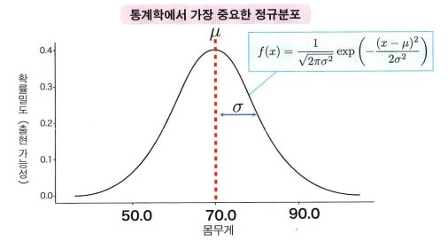

# 3.5. 이론적인 확률분포 내용 정리

#### 확률분포와 파라티머
1. 수식으로 표현
2. 분포의 형태를 정하는 숫자이 **파라미터(parameter)** 를 가짐.
4. 파라미터를 알면 **확률분포의 형태** 를 알 수 있음.

#### 정규분포 (가우스 분포)

**확률밀도 함수 식**  
$f(x)=
\frac{1}{\sqrt {2πσ^2}} exp[-\frac{(x-μ)^2}{2σ^2}]
$  

- 확률분포가 평균μ와 표준편차σ 라는 2가지 파라미터가 정해짐.
- 정규분포는 N(μ,σ^2)으로 표기.
- 이때 평균 μ=0, 표준편차 σ=1인 정규분포 N(0, 1)을 *표준정규분포* 라고 함.
- μ는 분포의 위치, σ는 분포의 넓이를 결정
  
  
**정규분포 특징**
- 평균 μ 중심으로 한 종형, 좌우 대칭 분포임.
- 평균 μ 근처에 값이 가장 많고,  평균 μ에서 멀어질수록 적어짐.  
  
  
**정규분포 성질**
- μ-σ부터 μ+σ까지의 범위 값이 있을 확률 -> 약68% 
- μ-2σ부터 μ+2σ까지의 범위 값이 있을 확률 -> 약95% 
- μ-3σ부터 μ+3σ까지의 범위 값이 있을 확률 -> 약99.7%   

 **알 수 있는 점 : 이러한 특징과 성질은 μ나 σ의 값이 달라져도 변하지 않습니다.**

