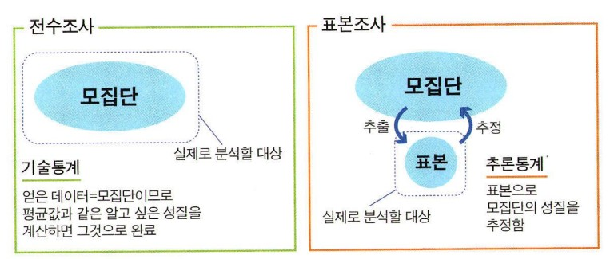
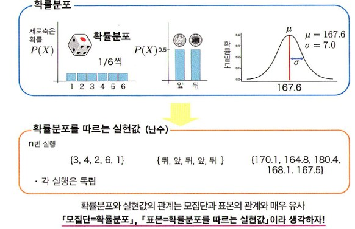
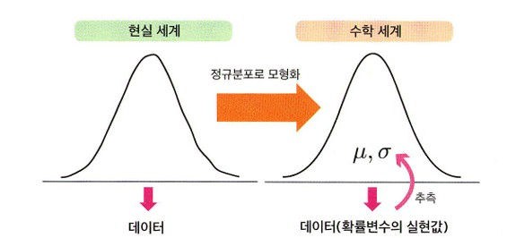
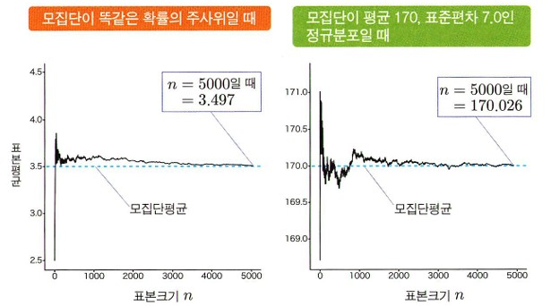
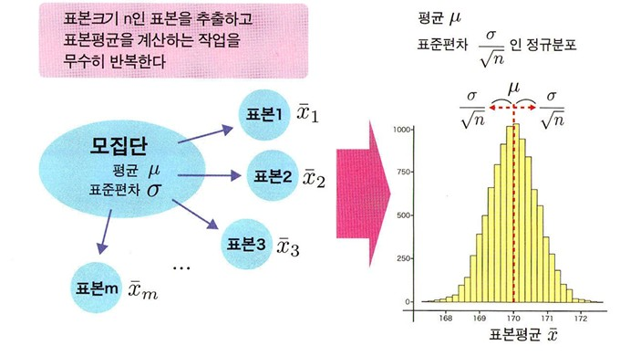
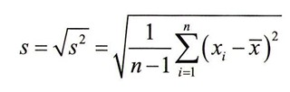
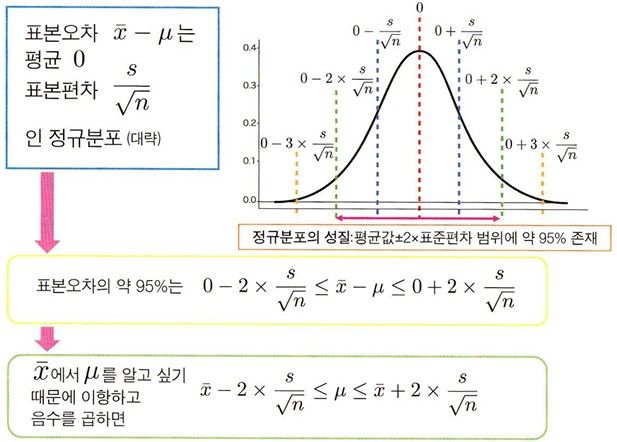

# (p87-115) 4. 추론통계 ~ 신뢰구간 내용 정리
---
## 추론 통계를 배우기 전에
### 전수조사와 표본조사
모집단을 알아보고자 사용하는 방법은 크게 2가지로 나누어짐.

1. 전수조사
- 모집단의 모든 요소를 조사함.
- 기술 통계 방법을 사용해 모든 요소로부터 알고자 하는 성질을 계산하고 평가하면 알고 싶은 것을 알아낼 수 있음.

2. 표본조사
- 모집단의 일부인 표본으로 모집단의 성질을 추정.
- 추론 통계 방법을 통해 모집단을 추정하는 분석에 기반을 두고 있음. 

 

### 데이터를 얻는다는 것
= 모집단에 포함된 전체 값으로 구성된 분포에서 일부를 추출하는 것

#### 모집단분포
: 모집단을 나타내는 분포
- 모집단분포가 양적 변수의 분포라면 평균이나 분산을 정의할 수 있음.
- 이를 각각 모평균, 모분산이라고 함.
- 모집단분포를 특징 짓는 양을 **모수** 또는**파라미터** 라고 부름.

 

#### 확률 분포와 실현값
  
확률 분포를 알고 있으며 여기서 발생하는 실현값이 확률적으로 어떻게 움직일지 이해할 수 있음.  
확률 분포와 실현값의 관계는 모집단과 표본의 관계와 매우 비슷함.  
'모집단 = 확률분포', '표본 = 확률분포를 따르는 실현값'이라 생각하자. 

### 데이터로부터 그 발생원의 확률분포 추정하기
모집단과 표본의 관계를 확률변수와 실현값의 관계로 바꾸어 보면
'얻은 표본으로 모집단을 추정한다.'라는 목표를  
-> **"얻은 실현값으로 이 값을 발생시킨 확률분포를 추정한다."**  
라는 목표로 바꾸어 말할 수 있음. 

 

### 모집단분포 모형화
- 모형화  
  정의 : 수학적인 확률분포로 모집단분포를 근사하는 것.
 

 

현실 세계의 모집단분포는 약간 비뚤어진 형태일 것이므로, 이를 직접 다루기는 어렵습니다.  
이에 수학적으로 이상적인 분포(모형)로 근사함으로써 다룰 수 있는 형태로 바꾸게 됨.  
 

### 무작위추출
모집단에서 표본을 얻을 때 중요한 것이 **무작위추출**임.   
**정의**: 데이터를 얻을 때 모집단에 포함된 요소를 하나씩 무작위 선택하여 추출하는 방식.   

#### - 방법
**1. 단순무작위 추출법**
표본에 있을 수 있는 모든 요소를 목록으로 만들고, 난수를 이용하여 표본을 정하는 것. 

**2.층화 추출법**
모집단을 몇 개의 층(집단)으로 미리 나눈 뒤, 각 층에서 필요한 조사대상을 무작귀로 추출하는 방법.

(편화된 추출로써 표본을 만든 경우라면, 표본으로 모집단을 올바르게 추정할 수 없음. )

 

### 데이터 얻는 법
모집단에 대해 추정한 결과를 어느 정도 일반화할 수 있는가는, 각 분야 고유의 지식(도메인 지식)에 따라 달라짐. 

 

### 추론통계를 직감적으로 이해하기
데이터 획득 다음으로 추론의 사고방식으로 넘어가게 됨.
 
시사점 : 
정말로 알고자하는 것은 표본 데이터가 아니라 모집단임.  
모집단의 모든 요소를 다 조사하는 전수 조사는 어려움.  
작은 크기의 표본으로도 모집단을 추론할 수 있음.  
표본을 추출할 때는 무작위로 추출해야함.  

---
## 표본오차와 신뢰구간

### 모집단과 데이터 사이의 오차 고려하기
- 정말로 알고 싶은 것은 모집단 평균이지만 모집단을 직접 알 수 없으므로 표본을 모집단에서 무작위로 추출하여 모집단 평균을 추정하는 것으로 생각하기.

 

### 표본오차
- 일반적으로 표본 평균은 모집단 평균과 일치하지 않음.
- 정말로 알고 싶은 것(모집단 평균)과 실제로 손 안에 있는 데이터에는 오차가 생기는 것
  -> **표본 오차**라고 함. 
표본 오차는 표본을 추출할 때 인위적인 실수나 잘못으로 생기는 오차가 아님.
데이터 퍼짐이 있는 모집단에서 확률적으로 무작위 표본을 고르는 데서 발생하는, 피할 수 없는 오차임.
ex. 주사위의 표본오차

 

#### 표본 오차는 확률적으로 바뀜.
표본은 모집단의 성질과 정확히 일치하지 않고, 확률 오차를 수반함. 
따라서 표본으로 모집단의 성질을 정확히 알아맞히기는 불가능함.

### 큰 수의 법칙  
**정의** : 표본 크기 n이 커질수록 표본 평균

### 모집단분포 모형화
- 모형화  
  **정의** : 수학적인 확률분포로 모집단분포를 근사하는 것.
  
 

 
현실 세계의 모집단분포는 약간 비뚤어진 형태일 것이므로, 이를 직접 다루기는 어렵습니다.  
이에 수학적으로 이상적인 분포(모형)로 근사함으로써 다룰 수 있는 형태로 바꾸게 됨. 

 

### 무작위추출
모집단에서 표본을 얻을 때 중요한 것이 **무작위추출**임. 
정의 : 데이터를 얻을 때 모집단에 포함된 요소를 하나씩 무작위 선택하여 추출하는 방식. 

 

#### 방법
**1. 단순무작위 추출법**
표본에 있을 수 있는 모든 요소를 목록으로 만들고, 난수를 이용하여 표본을 정하는 것. 

**2.층화 추출법**
모집단을 몇 개의 층(집단)으로 미리 나눈 뒤, 각 층에서 필요한 조사대상을 무작귀로 추출하는 방법.

(편화된 추출로써 표본을 만든 경우라면, 표본으로 모집단을 올바르게 추정할 수 없음. )

 

### 데이터 얻는 법
모집단에 대해 추정한 결과를 어느 정도 일반화할 수 있는가는, 각 분야 고유의 지식(도메인 지식)에 따라 달라짐. 

### 추론통계를 직감적으로 이해하기
데이터 획득 다음으로 추론의 사고방식으로 넘어가게 됨.
 
시사점 : 
정말로 알고자하는 것은 표본 데이터가 아니라 모집단임.  
모집단의 모든 요소를 다 조사하는 전수 조사는 어려움.  
작은 크기의 표본으로도 모집단을 추론할 수 있음.  
표본을 추출할 때는 무작위로 추출해야함.  

---
## 표본오차와 신뢰구간

### 모집단과 데이터 사이의 오차 고려하기
- 정말로 알고 싶은 것은 모집단 평균이지만 모집단을 직접 알 수 없으므로 표본을 모집단에서 무작위로 추출하여 모집단 평균을 추정하는 것으로 생각하기.

 

### 표본오차
- 일반적으로 표본 평균은 모집단 평균과 일치하지 않음.
- 정말로 알고 싶은 것(모집단 평균)과 실제로 손 안에 있는 데이터에는 오차가 생기는 것
    -> **표본 오차**라고 함. 
표본 오차는 표본을 추출할 때 인위적인 실수나 잘못으로 생기는 오차가 아님.
데이터 퍼짐이 있는 모집단에서 확률적으로 무작위 표본을 고르는 데서 발생하는, 피할 수 없는 오차임.
*ex. 주사위의 표본오차*

 

#### 표본 오차는 확률적으로 바뀜.
표본은 모집단의 성질과 정확히 일치하지 않고, 확률 오차를 수반함. 
따라서 표본으로 모집단의 성질을 정확히 알아맞히기는 불가능함.

 

### 큰 수의 법칙  
정의 : 표본 크기 n이 커질수록 표본 평균 $\bar{x}$  모집단 평균 μ에 한 없이 가까워진다는 법칙  
표본오차 $\bar{x}$ - μ가 0에 한없이 가까워진다는 뜻.  

 
검은색 실선이 표본평균 $\bar{x}$를 파란색 점선은 모집단평균 μ를 나타냄.  
표본 크기 n을 늘리면 표본평균 $\bar{x}$는 모집단평균 μ 가까워짐.

 

#### 표본 오차의 확률분포
표본오차의 확률분포를 알면 어느 정도 크기의 오차와 확률로 나타나는지 알 수 있게 됨.

 

### 중심극한정리
**정의** : 표본오차의 분포에 관해 중요한 정보를 제공하는 것.  
모집단이 어떤 분포이든 간에, 표본크기 n이 커질 수록 표본평균  $\bar{x}$의 분포는 정규분포로 근사할 수 있다는 것을 의미.

표본평균 $\bar{x}$는 모집단평균 μ를 중심으로 분포함.  
좌우에 표주년차 1개만큼 $σ/\sqrt{n}$ 의 폭으로 퍼져 분포.  
표본크기 n이 커질수록  $σ/\sqrt{n}$ 작아지며, 이는 표본평균 $\bar{x}$와 모집단평균 μ 사이의 어긋남이 평균적으로 작아진다는 것을 뜻함.  

### 추정량
**정의** : 모집단의 성질을 추정하는 데 사용하는 통계량

**1. 일치추정량**
표본크기 n을 무한대로 했을 때, 모집단의 성질과 일치하는 추정량

**2. 비편향추정량**
- 추정량의 평균값(기댓값)이 모집단의 성질과 일치할 때의 추정량
- 매번 얻을 때마다 확률적으로 다른 값이 되지만, 평균으로 보면 모집단의 성질을 과대하지도 과소하지도 않게 나타내는 양. 
- 모집단의 성질을 추정할 때 편향된 추정은 바람직하지 않음.
- 표본평균은 모집단평균 μ를 편향되지 않게 추정하는 비편향추정량.
 

  
n-1로 나누는 이유는 과소평가를 보전하기 위함.

### 표본오차의 분포
표본오차 = $\bar{x}$ - μ의 분포는 평균 0이 됨.  
분포 전체를 μ만큼 평행이동한 것이기 때문.  
하지만 표준편차는 그대로 $σ/\sqrt{n}$임.  
따라서 표본크기 n이 커질수록 표본오차 $\bar{x}$ - μ의 분포는 다음 정규분포는 근사할 수 있음.
- 평균 : 0
- 표준편차 : $σ/\sqrt{n}$

σ는 모집단의 성질이므로 보통 알 수 없는 미지의 숫자임.  
표본에서 추정한 비편향표준편차 s를 σ 대신 사용한 $s/\sqrt{n}$를 표준오차로 삼음.  

### 신뢰구간
간단하게 오차를 정량하기 위해서 신뢰구간 개념 도입.

  

정규분포의 성질 "평균값±2x표준편차 범위에 약 95% 존재. 

#### 해석
모집단에서 표본을추출하여 nn% 신뢰구간을 구하는 작업을 100번 반복했을 때 평균적으로 그 구간에 μ가 포함되는 것이 nn번이란 뜻.  
신뢰구간은 표본에서 구한 모집단 μ의 추정값을 어느 정도 신뢰할 수 있는지를 나타낸다고 할 수 있음. 

### t분포와 95% 신뢰구간
1.96 기억하기  
σ 대신 s를 써야만 한다는 것 -> 이때 활약하는 것이 **t분포**

**t분포**  
모집단이 정규분포라는 가정하에 미지의 모집단 표준편차 σ를 표본으로 계산한 비편향표준편차 s로 대용했을 때,  
$\bar{x}-μ$를 표준오차를 $s/\sqrt{n}$로 나누어 표준화한 값이 따르는 분포. 

$\bar{x}-μ \over s/\sqrt{n}$

#### 정밀도 높이려면
표준 오차를 작게 만들기 위해  
(1) 분자인 비편향표준편차 s를 작게 하는 방법  
- s는 모집단 데이터 퍼짐이라는 모집단 그 자체의 성질에서 유래하기에 작게 만들기 어려움.  
- 하지만 측정한 데이터 퍼짐(변동) 정도를 줄일 수 있음.  
- 데이터 퍼짐이 증가하면 결과적으로 s가 커지기 때문에 측정을 정밀하게 실시하는 식으로 대처 가능.
   

(2) 분모인 표본 크기n를 크게 하는 방법  
- 큰 표본을 추출하는데 비용이 많이 들기 때문에 쉽지 않음.
- 신뢰구간을 1/a로 좁히고 싶다면 표본크기 n을 $a^2$ 배로 해야한다는 점에서 노력이 필요함.

#### t 분포를 사요할 때 주의할 점.
- 표본크기 n이 작아도 적용 가능한 t분포에서는 **정규분포에서 얻은 데이터**라는 가정 필요.  
- 데이터의 배경에 있는 모집단분포가 완벽한 정규 분포일 수는 없으므로 95% 신뢰구간이 정확한 95%가 아니라는 점에서 주의해야함. 
