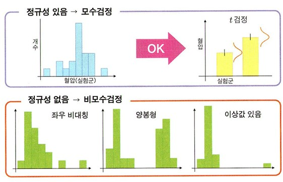
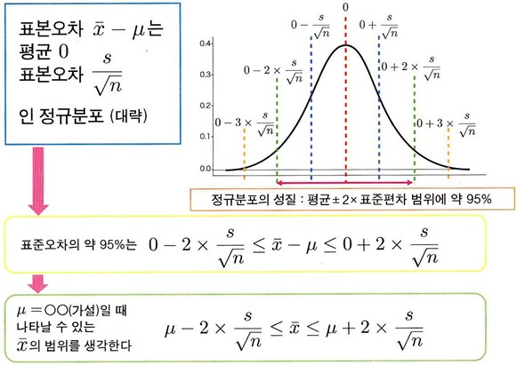
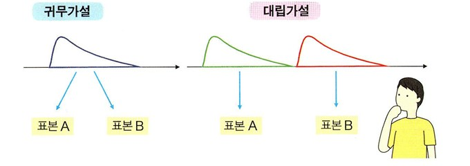
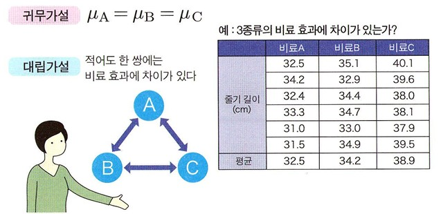
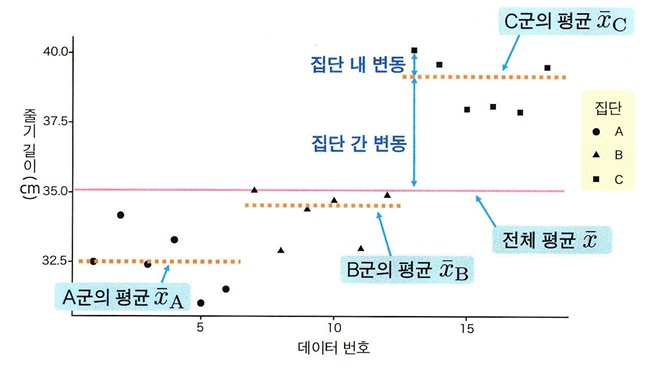

(p147-172) 6. 다양한 가설검정 내용 정리

## 다양한 가설검정
---
### 가설검정 방법 구분해 사용하기
**가설검정 해석의 흐름**
1. 귀무가설 설정  
2. 데이터로 검정통계량 계산  
3. 귀무가설이 옳다는 가정하에 검정통계량의 이론적 분포 생각,  
   데이터로 얻은 검정 통계량이 어느 위치에 있는지 산출  
  
가설검정 방법을 선택할 때는 다음에 설명하는 데이터 유형, 표본의 수, 양적 변수 분포의 성질을 먼저 확인하도록 하기.  

 

### 데이터 유형
- **분할표** : 각 상태에 몇 개 데이터가 있는지를 나타내는 표
- **산점도** : x-y 평면에 각 데이터를 점으로 찍는 그림  
데이터 유형이 양적 변수인지 질적 변수인지에 따라 해석 방법이 달라지므로 먼저 데이터 유형부터 확인.

 

### 표본의 수  
-> 분석 방법 선택에서 중요한 요소임. 

### 양적 변수의 성질
- 어떤 분포를 취하는지가 검정 방법 선택할 때 중요함.
 

**모수검정** : 특벙 분포를 따른다는 가정을 둔 가설검정
- 모수검정 대부분은 모집단의 분포가 정규분포인 경우임.
- **정규성** : 데이터가 정규분포로부터 얻어졌다고 간주할 수 있는 성질  
 

모집단 분포가 특정 분포라고 가정할 수 없는 경우 모수 검정을 이용하기 적절하기 않음.  
대신 평균이나 표준편차 등의 파라미터 기반을 두지 않는 **비모수검정**으로 분류되는 방법 이용.  
 

 

## 대표값 비교
---
### 일표본 t 검정
- t 검정은 표본이 하나라도 실행할 수 있음.
- **일표본 t검정** : 2가지 조건을 비교하는 것이 아닌, 어떤 평균값의 모집단에서 효본을 얻었는가를 조사.
- 전제 :  
  1. 귀무가설 : 모집단은 평균은 m = OO이다.  
  2. 대립가설 : 모집단은 평균은 m = OO이 아니다.  

 

 
- m에 구체적인 값(귀무가설 값)을 대입하면 약 95% 범위를 얻을 수 있음.  
- 이 범위에 포함되지 않는 극단적인 값이 나타날 확률은 p<0.05가 됨.  
- 95% 신뢰구간을 구하는 것과 a=0.05의 유의수준으로  
  귀무가설을 검정하는 것은 x̄에서 생각할지 귀무가설 m = OO에서 생각할지의 차이뿐. 

### 이표본 t 검정  
- 전제 :
  1. 귀무가설 : 2개 집단의 평균값은 같다. (평균값의 차이 = 0)  
  2. 대립가설 : 2개 집단의 평균값은 다르다. (평균값의 차이 ≠  0)
     
 

- t검정은 모수검정으로 분류되는 검정방법이기 때문에 데이터에 정규성이 있어야 함.   
- 분산이 일치하지 않는 경우에는 **웰치의 t검정** 이용.

### 대응 관계가 없는 검정과 대응관계가 있는 검정
 - 이표본 t검정은 *대응 관계가 없는 검정* 이라 불리는 방법
 - 일표본 t검정은 *차이 평균값 = 0* 을 귀무가설로 삼아 해석하는 것이 가능함.
 - 대응 관계가 있는 데이터일 때 똑같이 대응 관계가 있는 검정을 이용하는 편이 좋음.
 - 제2종 오류가 발생할 확률이 낮아지며 검정력도 오르는 경향이 있기 때문.  

 

### <적절하지 않은 검정을 사용하면 어떻게 될까?>
1) 정규분포에서 데이터를 얻었다고 볼 수 없을 때 t검정 사용한다면  
   - 유의수준 a를 0.05로 설정하더라도, 제 1종 오류가 일어날 확률이 0.05가 아니게 됨.
   - 설정한 값보다 커지는 것이 중대한 문제.  
   - 차이가 없음에도 차이가 있다고 판단해 버리는 오류가 유의수준으로 설정한 값보다 높은 확률로 일어나 큰 문제가 됨.

 2) 계산되는 p값이 그 정의의 귀무가설 하에서 관찰된 값 이상으로 극단적인 값을 얻을 수 있는 확률보다 커지게 되면  
    - 제1종 오류를 일으킬 확률이 설정한 값보다 작아짐.
    - 그만큼 제 2종 오류가 일어나기 쉬운 방법.
    - 보수적인 방법이라고 표현되기도 하지만 이 역시 문제임.
    

   ### 정규성 조사 
   - 모수 검정에서는 각 집단의 데이터에 정규성이 있어야 함.
   - **정규성 조사방법**  
     1. Q-Q플롯 : 시각적으로 판단할 수 있음.  
     2. 샤피로-윌크 검정 : 가설검정으로 조사함.  
     3. 콜모고로프-스미르노프(K-S)검정 : 이론적인 분포와 비교함.  

#### 샤피로-월크 검정
전제 : 
1. 귀무가설 : 모집단이 정규분포다.  
2. 대립가설 : 모집단이 정규분포가 아니다.

   
 
- 2개 집단이 있을 때는 각 집단의 정규성을 조사하는 검정을 실시하고, 그 다음 t검정을 이용하게 되므로  
가설 검정 작업을 반복해 버리는 **검정 다중성 문제**가 생김.  
- 데이터가 정규분포에서 얻어졌는지 여부를 조사하는 가장 좋은 없다고 해도 좋을 것임.  
- 표본크기가 클 때는 아주 조금 정규분포에서 벗어난 것만으로도 정규성 검정 결과가 p<0.05가 되어, 정규 분포에서 얻은 것이 아니라고 판단되고 만다. 

### 등분산성 조사
- t 검정과 분산분석에는 데이터가 분산이 같은 모집단으로 획득되었다는 조건이 필요.  
- 분산이 같다는 가설을 조사하는 검정으로는 **바틀렛 검정**이나 **레빈 검정**이 있음.

 
  
- 전제 :
1. 귀무가설 : 2개 모집단의 분산이 같다.
2. 대립가설 : 2개모집단의 분산이 같지 않다.
  
 

### 비모수검정의 대푯값 비교
- 각 집단 데이터에 정규성이 없는 경우에는 비모수검정으로 분류되는 방법을 사용하는 것이 권장.
- 평균값 대신 분포의 위치를 나타내는 *대푯값*에 주목하여 해석

   
  
<**윌콕슨 순위합 검정**> 
  
- 평균값 대신 각 데이터 값의 순위에 기반하여 검정을 실시함.  
- 정규분포를 따르지 않는 데이터의 위치 파라미터 검정 방법.

 

- 전제 :  
  1. 귀무가설 : 2개 모집단의 위치가 같다.  
  2. 대립가설 : 2개모집단의 위치가 다르다.  

 

<**맨-휘트니 U 검정**>
- 이 방법을 사용하려면 비교할 2개 집단의 분포 모양 자체가 같아야 함.
- 분포는 정규분포가 아니더라도 괜찮지만, 분산이 다르다면 문제가 생길 수 있음.

 

- 전제 :
  1. 귀무가설 : 2개 모집단의 위치가 같다.  
  2. 대립가설 : 2개모집단의 위치가 다르다.

그 외 플리그너-폴리셀 검정, 브루너-문첼 검정도 있음.  

### 분산분석 (3개 집단 이상의 평균값 비교)
  

- 전제 :
  1. 귀무가설 : 모든 집단의 평균이 같다.  
  2. 대립가설 : 적어도 한 쌍에는 차이가 있다.

 

### 분산분석의 원리  
  
- 집단 내 변동은 동일 조건에서의 데이터 퍼짐이므로, 원래 존재하는 무작위 오차의 크기 나타냄.  
- 집단 간 변동은 집단 간의 차이를 나타냄. 
- 집단 간 차이가 있다면 큰 데이터 퍼짐을, 반대로 차이가 없다면 집단 내 편차와 같은 정도로 작은 데이터 퍼짐을 기대할 수 있음.
- F값 = (평균적인 집단 간 변동)/(평균적인 집단 내 변동)을 계산하여 검정통계량을 만듦.  

### 자유도
**정의** : 자유로이 움직일 수 있는 변수의 수를 나타냄.  
t 분포의 형태를 결정할 때에 쓰임.  

### 다중비교 검정  
- 어느 쌍에 차이가 있는지 알고 싶다면 다중비교 사용해서 조사해야함.  
- 집단이 n개인 경우 nC2개의 쌍이 있으므로, 집단의 수가 늘어날수록 제 1종 오류가 일어나기 쉬움.
- 이 다중성 문제를 회피하고자 다중비교 검정을 이용함.
- 다중 비교 검정의 기본 아이디어는 검정을 반복하는 만큼, 유의수준을 엄격한 값으로 변경하는 것임.
 

### 여러 가지 다중비교 방법 
#### 1. 본페로니 교정
**정의** : 전체에서 유의수준 a를 설정했을 때 검정 반복 횟수를 k라 하고, 매 검정에서는 a를 검정 횟수로 나눈 값 a/k를 기준으로 가설ㄹ검정을 하는 방법임.
- **p<a/k** 라면 대립가설을 채택하는 것임.
- t검정을 각 쌍에서 시행하여 p<a/k라면 차이가 있다고 판단함.
- 장점 : 무척 간편하여 평균값 비교뿐 아니라 다양한 다중 비교에서 사용할 수 있음. 
- 단점 : 검정력이 낮은 경향이 있어, 정말로 차이가 있을 때에 차이가 있다고 주장하기 어려움.
  (본페로니 교정보다 검정력을 개선한 방법인 **튜키검정** 등 다른 방법을 사용할 때가 흔함.)

 

#### 2. 던넷 검정
- 모든 쌍을 비교하는 튜키 검정보다도 검정력이 향상됨,.

 

#### 3. 윌리엄스 검정
- 집단 간에 순위를 매길 수 있는 경우에는 해당 ㄱ머정을 사용하는 편이 검정력이 좋음.

 

### 3집단 이상의 비모수검정
정규성이 없는 지단이 1개 이상이라면? -> **크러스컬-윌리스 검정** 권장.  
튜키 검정에 상응하는 것 -> **스틸-드와스 검정**  
던넷 검정에 상응하는 것 -> **스틸 검정**

 

## 비율 비교
--- 
### 범주형 데이터
**정의** : 각 범주에 포함된 개수만이 계산 가능한 값.  

 

### 이항검정
**정의** : 하나의 범주가 확률 P, 또 하나의 범주가 확률 1-P로 나타나는지 조사하는 방법.   
2개 범주를 관찰해 얻은 빈도(개수)가 이론적인 비율에 따른 것인지를 조사하는 검정. 

 

- 전제 :
  1. 귀무가설 : 앞면이 1/2, 뒷면이 1/2확률로 나온다(치우치지 않음.)  
  2. 대립가설 : 앞면이 1/2, 뒷면이 1/2확률로 나오지 않는다.(어딘가 치우침이 있음.)

 

### 카이제곱검정 : 적합도검정
카이제곱검정의 일종인 **적합도검정**을 이용함으로써, 특정 이산확률분포에서 얻은 데이터인지 조사할 수 있음.

 

- 전제 :
  1. 귀무가설 : 모집단은 상정한 이산확률분포이다.  
  2. 대립가설 : 모집단은 상정한 이산확률분포가 아니다.
 
 
 
- 카이제곱검정의 적합도검정에서는 귀무가설의 확률분포에서 얻을 수 있는 기대도수를 게산.
- 검정통계량은 χ²값(카이제곱값)라고 부릅.
- 귀무가설이 옳다면 이는 χ² 분포라는 확률분포를 따름.
- 이 분포 안에서 실제로 얻은 χ²의 값의 위치를 구하여 p값을 도출.  

 

### 카이제곱검정 : 독립성검정
- 한쪽 변수의 범주가 바뀌었을 때 다른 쪽 변수의 범주 비율이 달라지지 않을 때, 2개 변수는 독립적이라고 말할 수 있음.
- 이를 조사하려면 **독립성검정**을 이용.
- χ²값이 등장하여 χ²분포를 이용하여 **카이제곱검정의 독립성검정**이라고 부름.

 

- 전제 :
  1. 귀무가설 : 2개의 변수는 독립이다.  
  2. 대립가설 : 2개의 변수는 독립이 아니다.
 
 

**구체적인 계산**  
= $(실제 출현도수 - 기대도수)^2$ / (기대도수)

