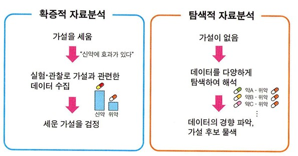
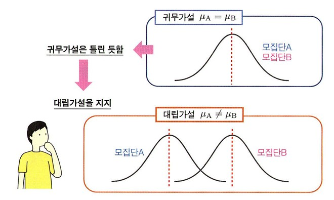
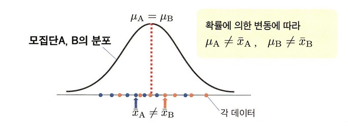

(p117-143) 5. 가설검정 내용 정리

## 가설검정의 원리
**정의** : 분석자가 세운 가설을 검증하기 위한 방법  
가설 검정에서는 **p-value**라는 수치를 계산하여 가설을 지지하는지 여부를 판단함.
 

### 가설 검증하기

 

**1. 확증적 자료분석(가설검증형 데이터 분석)**  
   : 미리 세운 가설을 검증하는 접근법
 

**2. 탐색적 자료분석**  
   : 가설을 미리 세우지 않고, 전체 데이터를 탐색적으로 해석하는 접근법
   데이터의 특징이나 경향을 파악  
   가설 후보를 찾는 것을 목적하는 데이터 분석  
 

### 가설 검정
: 데이터 기반을 둔 통계 가설을 검증하는 방법  
 
**비교한다는 것** = 2개(또는 그 이상)의 집단이 있음.    
**실험군** : 어떠한 조치를 취한 집단  
**대조군** : 실험군과 비교, 대조를 위해 마련한 집단  
  
세운 가설은 모집단을 대상으로 한 가설임. (표본을 대상으로 한 가설이 아님)  

### 귀무가설과 대립가설

 

**귀무가설** : 밝히고자 하는 가설의 부정 명제  
**대립가설** : 빍히고 싶은 가설
  
귀무가설이 옳다 -> 대립 가설이 틀림   
귀무가설이 틀리다 -> 대립 가설이 옳다.  
일반적으로 귀무가설은 어떤하나의 상태를 생각함.  
**μa = μb** 상태  
 
귀무가설과 대립가설에는 비대칭성이 있음.
대립 가설을 부정하여 귀무가설을 지지하는 것은 불가능함. 

### 모집단과 표본의 관계
귀무가설 μa = μb가 옳다 하더라도 \bar{xa} ≠ \bar{xb}가 됨.
  

 
모집단A와 모집단B의 평균이 같더라도, 표본평균 \bar{xa}나 \bar{xb}는 μa와 μb와는 어긋나서 \bar{xa} ≠ \bar{xb}가 되어버림.

### p 값 (p-value)
**정의** : 현실에서 얻은 데이터가 귀무가설이 옳은 가상 세계에서는 얼마나 나타나기 쉬운지, 어려운지 평가하는 값  
           0 이상 1 이하의 값이 됨.   
값이 작다 -> 귀무가설이 옳은 세계에서는 현실에서 얻은 데이터가 잘 나타나지 않음.  
ex) p=0.01이라면, 귀무가설이 옳은 세계에서 평균값의 차이가 +10 이상이거나 -10이하가 될 확률이 1%임.  

### p값과 유의수준 a를 이용한 가설 판정
1) p값이 0.05 이하인 경우, 현실 데이터는 나타나기 어렵다고 생각하고  
귀무가설을 **기각**, 대립가설은 **채택**

2) p값이 0.05를 상회하는 경우,
**통계적으로 유의미한 차이를 발견하지 못했다.**  
(귀무가설이 옳다는 것이 아니라, 틀렸다고 말할 수 없다는 뜻임.)  

**유의수준(a)** : 귀무가설을 기각할 것인지 채택할 것인지 판단 경계로 이용하는 값

