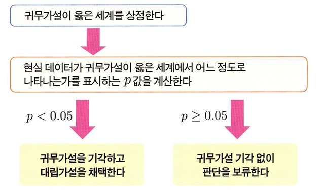
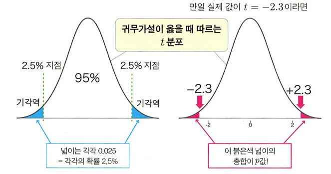
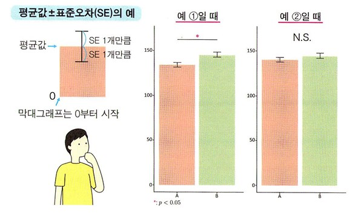
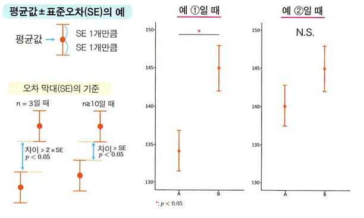
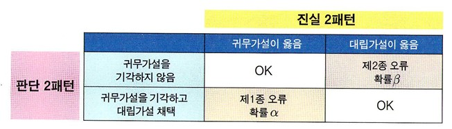
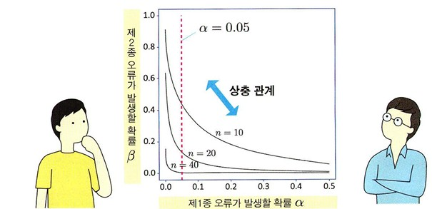
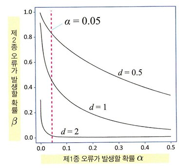

(p117-143) 5. 가설검정 내용 정리

## 가설검정의 원리
**정의** : 분석자가 세운 가설을 검증하기 위한 방법  
가설 검정에서는 **p-value**라는 수치를 계산하여 가설을 지지하는지 여부를 판단함.
 

### 가설 검증하기

 

**1. 확증적 자료분석(가설검증형 데이터 분석)**  
   : 미리 세운 가설을 검증하는 접근법
 

**2. 탐색적 자료분석**  
   : 가설을 미리 세우지 않고, 전체 데이터를 탐색적으로 해석하는 접근법
   데이터의 특징이나 경향을 파악  
   가설 후보를 찾는 것을 목적하는 데이터 분석  
 

### 가설 검정
: 데이터 기반을 둔 통계 가설을 검증하는 방법  
 
**비교한다는 것** = 2개(또는 그 이상)의 집단이 있음.    
**실험군** : 어떠한 조치를 취한 집단  
**대조군** : 실험군과 비교, 대조를 위해 마련한 집단  
  
세운 가설은 모집단을 대상으로 한 가설임. (표본을 대상으로 한 가설이 아님)  

 

### 귀무가설과 대립가설

 

**귀무가설** : 밝히고자 하는 가설의 부정 명제  
**대립가설** : 빍히고 싶은 가설
  
귀무가설이 옳다 -> 대립 가설이 틀림   
귀무가설이 틀리다 -> 대립 가설이 옳다.  
일반적으로 귀무가설은 어떤하나의 상태를 생각함.  
**μa = μb** 상태  

 
귀무가설과 대립가설에는 비대칭성이 있음.
대립 가설을 부정하여 귀무가설을 지지하는 것은 불가능함. 

 

### 모집단과 표본의 관계
귀무가설 μa = μb가 옳다 하더라도 \bar{xa} ≠ \bar{xb}가 됨.
  

 
모집단A와 모집단B의 평균이 같더라도, 표본평균 $\bar{xa}$나 $\bar{xb}$는 μa와 μb와는 어긋나서 $\bar{xa}$ ≠ $\bar{xb}$가 되어버림.

 

### p 값 (p-value)
**정의** : 현실에서 얻은 데이터가 귀무가설이 옳은 가상 세계에서는 얼마나 나타나기 쉬운지, 어려운지 평가하는 값.  
           0 이상 1 이하의 값이 됨.   
값이 작다 -> 귀무가설이 옳은 세계에서는 현실에서 얻은 데이터가 잘 나타나지 않음.  
ex) p=0.01이라면, 귀무가설이 옳은 세계에서 평균값의 차이가 +10 이상이거나 -10이하가 될 확률이 1%임.  

 

### p값과 유의수준 a를 이용한 가설 판정
1) p값이 0.05 이하인 경우, 현실 데이터는 나타나기 어렵다고 생각하고  
귀무가설을 **기각**, 대립가설은 **채택**

2) p값이 0.05를 상회하는 경우,
**통계적으로 유의미한 차이를 발견하지 못했다.**  
(귀무가설이 옳다는 것이 아니라, 틀렸다고 말할 수 없다는 뜻임.)  

**유의수준(a)** : 귀무가설을 기각할 것인지 채택할 것인지 판단 경계로 이용하는 값

--- 

## 가설검정 시행

### 가설검정의 구체적인 계산  
가설검정의 개념은 다양한 검정기법에서 공통  
p값의 계산 방법은 서로 다름. 

 

**이표본 t 검정**
**정의** : 2개 집단 간의 평균값을 비교하는 검정.

$\bar{X}a$ - $\bar{X}b$ 를 s $\sqrt{\tfrac{1}{na} + \tfrac{1}{nb}}$로 나누어 표준화한 값인 t값을 새로운 주인공으로 삼아, t분포를 적용하면 됨.  
이것이 귀무가설이 옳을 때의 분포임.  

 
s는 비편향표준편차이긴 하지만 2개 집단이므로 계산 방법이 조금 다름.  
A군, B군의 비편향 표준편차라 하면, 2개 집단을 고려한 비편향표준편차 s는  
s = $\sqrt{\tfrac{(na-1)sa^2 + (nb-1)sb^2}{na + nb -2}}$

 

### 기각역과 p값
  
**기각역** : 좌우 2.5%씩의 영역을 유의수준 5%인 것.
실제 값이 이 귀무가설이 옳을 때의 t분포 내 어디에 위치하는지 구한 뒤, 그 이상의 극단적인 값이 나올 확률을 구한 것이 p값.  

**양측검정** : 양수와 음수 양쪽을 모두 고려하는 가설검정 방법  
**단측검정** : 어느 한쪽만 고려해 넓이를 계산하는 방법  

---

## 가설검정 관련 그래프
### 오차 막대
: 반복이 있는 데이터에서 평균값을 계산하여 막대그래프나 산점도를 그릴 때는, 평균값에 더하여 그 위아래로 오차 막대를 함꼐 그림.   

평균값의 확률을 나타내고 싶다면, 평균값## 모집단과 표본의 관계
귀무가설 μa = μb가 옳다 하더라도 \bar{xa} ≠ \bar{xb}가 됨.
  

 
모집단A와 모집단B의 평균이 같더라도, 표본평균 $\bar{xa}$나 $\bar{xb}$는 μa와 μb와는 어긋나서 $\bar{xa}$ ≠ $\bar{xb}$가 되어버림.

 

### p 값 (p-value)
**정의** : 현실에서 얻은 데이터가 귀무가설이 옳은 가상 세계에서는 얼마나 나타나기 쉬운지, 어려운지 평가하는 값.  
           0 이상 1 이하의 값이 됨.   
값이 작다 -> 귀무가설이 옳은 세계에서는 현실에서 얻은 데이터가 잘 나타나지 않음.  
ex) p=0.01이라면, 귀무가설이 옳은 세계에서 평균값의 차이가 +10 이상이거나 -10이하가 될 확률이 1%임.  

 

### p값과 유의수준 a를 이용한 가설 판정
1) p값이 0.05 이하인 경우, 현실 데이터는 나타나기 어렵다고 생각하고  
귀무가설을 **기각**, 대립가설은 **채택**

2) p값이 0.05를 상회하는 경우,
**통계적으로 유의미한 차이를 발견하지 못했다.**  
(귀무가설이 옳다는 것이 아니라, 틀렸다고 말할 수 없다는 뜻임.)  

**유의수준(a)** : 귀무가설을 기각할 것인지 채택할 것인지 판단 경계로 이용하는 값

--- 

## 가설검정 시행

### 가설검정의 구체적인 계산  
가설검정의 개념은 다양한 검정기법에서 공통  
p값의 계산 방법은 서로 다름. 

 

**이표본 t 검정**
**정의** : 2개 집단 간의 평균값을 비교하는 검정.

$\bar{X}a$ - $\bar{X}b$ 를 s $\sqrt{\tfrac{1}{na} + \tfrac{1}{nb}}$로 나누어 표준화한 값인 t값을 새로운 주인공으로 삼아, t분포를 적용하면 됨.  
이것이 귀무가설이 옳을 때의 분포임.  

 
s는 비편향표준편차이긴 하지만 2개 집단이므로 계산 방법이 조금 다름. 
A군, B군의 비편향 표준편차라 하면, 2개 집단을 고려한 비편향표준편차 s는  
s = $\sqrt{\tfrac{(na-1)sa^2 + (nb-1)sb^2}{na + nb -2}}$

 

### 기각역과 p값
  
**기각역** : 좌우 2.5%씩의 영역을 유의수준 5%인 것.
실제 값이 이 귀무가설이 옳을 때의 t분포 내 어디에 위치하는지 구한 뒤, 그 이상의 극단적인 값이 나올 확률을 구한 것이 p값.  

**양측검정** : 양수와 음수 양쪽을 모두 고려하는 가설검정 방법  
**단측검정** : 어느 한쪽만 고려해 넓이를 계산하는 방법  

---

## 가설검정 관련 그래프
### 오차 막대
: 반복이 있는 데이터에서 평균값을 계산하여 막대그래프나 산점도를 그릴 때는, 평균값에 더하여 그 위아래로 오차 막대를 함꼐 그림.   

- 평균값의 확률을 나타내고 싶다면, 평균값 ± 표준오차 (SEM - standard error of the meadn)를 사용함. 
- 신뢰구간을 나타내고 싶다면, 평균값을 중심으로 **95%** 신뢰구간을 그림. 
- 데이터 퍼짐을 나타내고 싶다면 평균값 ± 표준오차(mean ± SD)를 사용.
- 펑균값이 확률이 아니라, 단순히 데이터가 어느 정3도 퍼져 있는지를 시각화하고 있는 것임.

  
 
- 오차 막대가 무엇을 표시하고 있는지를 그래프 범례에 반드시 기재하도록 함. 

  
 
- SE를 오차 막대로 그릴 때, 이를 대략적으로 해석하는 방법은 각 집단의 표본크기(n)에 따라 달라짐. 
- 오차 막대 1개라고 하면, **표본 크기가 작을 때(n=3)** 에는 오차 막대 2개(SE 2개)만큼의 차이가 있어야만 비로소 p < 0.05가 됨.
- **표본 크기가 클 때** 차이가 오차 막대 1개 정도만 나도 p < 0.05가 됨.

### "통계적으로 유의미"를 나타내는 표기
*(별표가 1개) : 0.01 ≤ p < 0.05
**(별표가 2개) : p < 0.01
***(별표가 3개) : p < 0.001
유의마하지 않음 : **N.S**

---
## 제 1종 오류와 제 2종 오류
### 진실과 판단의 4패턴
  
- 왼쪽 위칸 : 귀무가설이 옳을 때 귀무가설을 기각하지 않으므로 옳은 판단임.
- 오른쪽 아래 칸 : 대립가설이 옳을 때 대립가설을 채택하므로 옳은 판단임.
- 왼쪽 아래 칸 : 귀무가설이 옳음에도 귀무가설을 기각하고 대립 가설을 채택하므로 잘못된 판단.
                **제1종 오류** 또는 **위양성**이라 함. 
                제1종 오류가 일어날 확률은 α임.
- 오른쪽 위 칸 : 대립가설이 옳음에도 귀무가설을 기각하지 않는 잘못된 판단.
                **제2종 오류** 또는 **위음성**이라 함.
                제2종 오류가 일어날 확률은 β임.

 

### 제 1종 오류
**정의** : 실제로는 아무런 차이가 없음에도 차이가 있다고 판단해 버리는 잘못을 말함. 
           유의수준 α의 값을 미리 정해 둠으로써, 제1종 오류가 일어날 확률을 통제할 수 있는 것.
        
 

### 제 2종 오류
**정의** : 정말로 차이가 있는데도 차이가 있다고 말할 수 없어, 귀무가설을 긱하지 않는 판단을 내려 버림.
정말로 차이가 있을 때 차이가 있다고 올바르게 판단할 확률을 **검정력** **1-β**라고 함.  
일반적으로 검정력 1-β를 80%로 설정.  
β(또는 1-β)는 α와는 달리 직접 통제할 수 없음. 

 

### α와 β는 상충 관계
α와 β 사이에는 **상충 관계**  
즉, 한쪽이 작아지면 또 다른 한 쪽은 커지는 관계가 있음.  
α와 β의 관계는 표본크기 n에 따라 달라짐.  

  
 
α를 고정하면 β가 줄어든다는 것을 알 수 있음.  
표본크기 n이 클수록, 정말로 차이가 있을 때에 그렇다고 판단할 확률인 검정력 1-β가 상승하는 것임.  

 

### 효과크기를 달리 했을 때의 α와 β
**효과크기** : 일반적으로 얼마나 큰 효과가 있는지를 나타내는 지표임.  
- 예를 들어 2개 집단의 평균값이 경우, 원래 갖고 있는 모집단의 데이터 퍼짐에 대해 상대적으로 가한 값 **d=(μa - μb) / σ**를 이용함.  
- 평균값의 차이에 비해 표준편차가 클수록 2개 분포의 겹치는 부분이 커짐  
  효과크기 d는 작아지고 평균값의 차이는 검출하기 어려워짐.
- 반대로 평균값의 차이에 비해 표준편차가 작을수록 2개 분포의 겹치는 부분은 작아지므로, 효과크기 d는 커진다고 해석.  
- 가설검정에서는 모집단을 대상으로 검출하고 싶은 효과크기를 미리 설정하는 것이 바람직함.  

 

  

 
α와 β, 표본크기 n, 효과크기 d의 네 값 중 셋을 결정하면, 나머지 하나는 자동으로 정해진다는 성질.  
